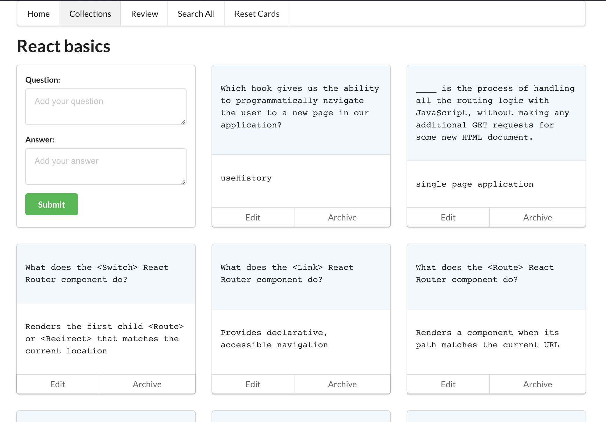
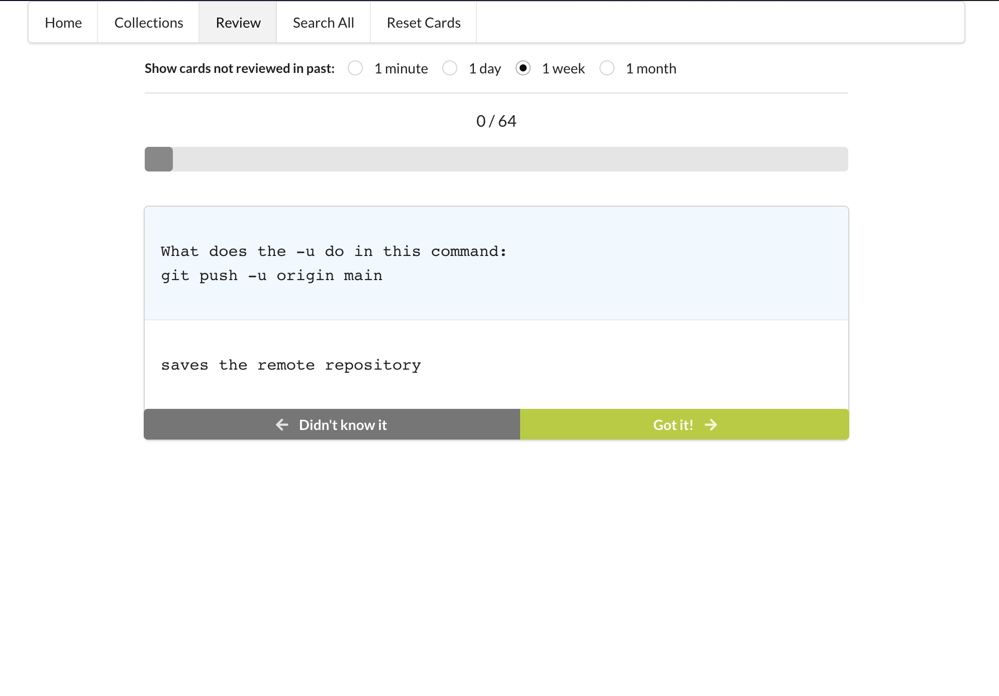

# Phase 2 Project: Study Cards

## Overview

Study Cards is a simple application that lets you create and practice with digital study cards, using the spaced repetition technique. With Study Cards, you can easily create a set of flashcards for any topic, and then use them to practice and reinforce your knowledge over time.

## Features

- Create and manage multiple decks of study cards
- Add, edit or archive individual cards within each collection
- For each card you can add text to both a question and answer section
- Start a review session which will fetch cards that require practice (based on last answer time and correct/incorrect answer)
- During a study session you see one card a time, after revealing the answer you can mark if you got it right or wrong

## Future features

- Stats to track your progress
- Support syntax formatted code snippet in cards
